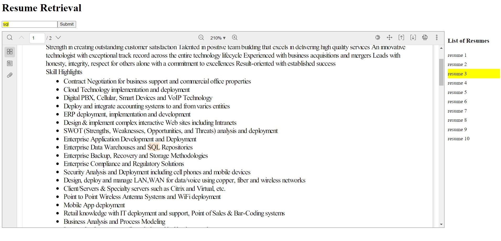

# Information Retrieval Project (Resume Matcher)
## Team Details
- Tejas Ajay Parse (S20200010209)
- Pranjay Gupta (S20200010169)

## About Resume-Matcher
- A system to perform keyword searches on CV/Resume and rank them by keyword matches. 
- Resumes are loaded in the documents folder on the server and indexes are generated.
- Once the indexes are generated, the client makes API calls to the server and fetches resumes based on the BM25 Scores.
- The main aim was to build a good information retrieval system. 
- The Client does have several features that one would need.

## How to use
- Client: Install all the dependencies using _<b>npm i</b>_. Run the client using _<b>npm start</b>_
- Copy all your resume PDFs in the _<b>server/server/dependency/documents/</b>_ folder
- Generate indexes using _<b>python generate.py</b>_
- Server: Install dependencies and run the server using _<b>python manage.py runserver</b>_

## Dataset Used  
- [Dataset link](https://github.com/TejasParse/devanagari-recognition-server/blob/master/Transfer%20Analysis.ipynb)

## FrontEnd

